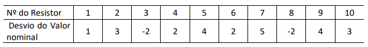

English | [Portuguese](descriptions_ptbr.md)

# Descriptions

## Introduction

This file aims to clarify the functioning of each function in the library, so that the developer can solve all your doubts. If you have read the document and still do not understand something or have encountered a problem, please open a new [issue](https://github.com/dayonoliveira/Statistic/issues) reporting the problem or question.

In each function you will have examples of how they work. The examples will be based on two sets of data, taken from a list of exercises in the Quantitative Methods in Computing course, from the Computer Science course at the University of Fortaleza.

1. discrete dataset:
    - Image of the set - Question 8:
        
        
        
    - List of set:
        - `[1,3,-2,2,4,2,5,-2,4,3]`
2. Continuous dataset:
    - Image of the set (class table) - Question 9:
        
        
        
    - Class list (unorganized):
        - `[50,60,60,70,70,80,80,90,90,100]`
    - List of absolute frequencies:
        - `[2,15,50,10,3]`

### Summary

  - [`GenCalcContinuousSets`](#gencalccontinuoussets)
  - [`GenCalcDiscreteSets`](#gencalcdiscretesets)
  - [`OrganizeSet`](#organizeset)
  - [`Fi`](#fi)
  - [`Fir`](#fir)
  - [`Fac`](#fac)
  - [`Fad`](#fad)
  - [`Facr`](#facr)
  - [`Fadr`](#fadr)
  - [`VarValues`](#varvalues)
  - [`MidPoints`](#midpoints)
  - [`FullRange`](#fullrange)
  - [`ClassBreadth`](#classbreadth)
  - [`Mean`](#mean)
  - [`Mode`](#mode)
  - [`Median`](#median)
  - [`SampleQtt`](#sampleqtt)
  - [`MaxMin`](#maxmin)
  - [`ContMean`](#contmean)
  - [`ContMode`](#contmode)
  - [`ContMedian`](#contmedian)
  - [`Percentile`](#percentile)
  - [`Quartiles`](#quartiles)
  - [`CreateClassTable`](#createclasstable)
  - [`SPTwo`](#sptwo)
  - [`SD`](#sd)
  - [`CV`](#cv)


## `GenCalcContinuousSets`

This function does all possible library calculations for continuous datasets, large or small, and returns all values ​​in a list. You can choose whether or not to print the results in the output.

### Parameters:

- `set: list`: Set of data as it is in the class table.
- `fi: list`: Absolute (simple) frequency of the data set.
- `printData: bool` (optional): This is responsible for dictating whether or not the function will print the results. By default it is set to `False`.

### Return:

- `resultVector: list`: Returns a list with all the results of all possible calculations from the library.
- `print` (Optional): There is the possibility to print the results after calculations.

### Example:

```python
gen_contSet:list = GenCalcContinuousSets(
  [50,60,60,70,70,80,80,90,90,100],
  [2,15,50,10,3],
  True
)
```

```bash
Classes: [[50, 60], [60, 70], [70, 80], [80, 90], [90, 100]]
Fi: [2, 15, 50, 10, 3]
Fir: [0.025, 0.1875, 0.625, 0.125, 0.0375]
Fac: [2, 17, 67, 77, 80]
Fad: [80, 78, 63, 13, 3]
Facr: [0.025, 0.2125, 0.8375, 0.9625, 1.0]
Fadr: [1.0, 0.975, 0.7875, 0.1625, 0.0375]
Mid points: [55.0, 65.0, 75.0, 85.0, 95.0]
Full range: 50.0
Class breadth: 10.0
Total samples: 80
Mean: 74.62
Mode: [74.67]
Median: 74.6
Variance: 56.82
Standart deviation: 7.54
Coefficient variation: 10.1
```

## `GenCalcDiscreteSets`

This function has the same purpose as the previous one, but its focus is on discrete data sets, large or small. It is also possible to choose whether the function will print the data when it is executed.

### Parameters:

- `set: list`: This is where the dataset goes. Unlike the previous function, this one does not receive data from the class table.
- `printData: bool` (optional): This is responsible for dictating whether or not the function will print the results. By default it is set to `False`.

### Return:

- `resultVector: list`: Returns a list with the results of all possible calculations from the library.
- `print`: There is also the possibility to print the results after all calculations.

### Example:

```python
gen_discSet:list = GenCalcDiscreteSets(
  [1,3,-2,2,4,2,5,-2,4,3],
  True
)
```

```bash
Set: [-2, -2, 1, 2, 2, 3, 3, 4, 4, 5]
Fi: [1, 2, 2, 2, 2, 1]
Fir: [0.1, 0.2, 0.2, 0.2, 0.2, 0.1]
Fac: [1, 3, 5, 7, 9, 10]
Fad: [10, 9, 7, 5, 3, 1]
Facr: [0.1, 0.30000000000000004, 0.5, 0.7, 0.8999999999999999, 0.9999999999999999]
Fadr: [0.9999999999999999, 0.8999999999999999, 0.7, 0.5, 0.30000000000000004, 0.1]
Mid points: [1, 3, -2, 2, 4, 5]
Full range: 7.0
Class breadth: 1.4
Total samples: 10
Mean: 2.0
Mode: [-2, 2, 3, 4]
Median: 2.5
Variance: 3.44
Standart deviation: 1.85
Coefficient variation: 92.5
```

## `OrganizeSet`

This function has the purpose of organizing the data referring to the class table. It takes a normal list of limits and returns a list of organized classes.

### Parameters:

- `classes: list`: Receives an array with class boundaries from the class table.

### Return:

- `aux: list`: Returns a list of classes arranged in small vectors within the list, similar to a class table.

> Warning: It is only for the purpose of transforming a boundary vector into a class vector. If you pass a set of discrete data it will not return a correct value for your purpose.

### Example:

```python
organized_classes:list = OrganizeSet(
  [50,60,60,70,70,80,80,90,90,100]
)
print(organized_classes)
```

```bash
[[50, 60], [60, 70], [70, 80], [80, 90], [90, 100]]
```

## `Fi`

This function calculates the absolute (simple) frequency of a set of discrete data. There is the possibility of returning a vector with only absolute frequencies or a vector with values ​​and their respective frequencies.

### Parameters:

- `set: list`: Here the raw dataset is inserted. It has to be passed in `list` form.
- `respectiveValues: bool`: This option allows you to alternate between the data return, allowing to return a vector with only the absolute frequencies (`False` by default) or the values ​​with their respective frequencies (`True`).

### Return:

- `freq: list`: Returns a list with only absolute frequencies, or a list of frequencies and their respective values.

### Examples:

Standard form:
```python
fi:list = Fi([1,3,-2,2,4,2,5,-2,4,3])
print(fi)
```

```bash
[1, 2, 2, 2, 2, 1]
```

Form with the respective values:
```python
fi:list = Fi([1,3,-2,2,4,2,5,-2,4,3], True)
print(fi)
```

```bash
[[1, 1], [3, 2], [-2, 2], [2, 2], [4, 2], [5, 1]]
```

## `Fir`

Function that calculates the relative frequency of the discrete dataset or classes, based on the absolute frequency. The return is a list of numbers like `float`.

### Parameters:

- `fi: list`: Receives the absolute frequency of the discrete dataset or the continuous dataset.

### Return:

- `aux: list`: Returns a list of the relative frequencies of the dataset.

### Examples:

Continuous dataset:
```python
fir:list = Fir([2,15,50,10,3])
print(fir)
```

```bash
[0.025, 0.1875, 0.625, 0.125, 0.0375]
```

Discrete dataset:
```python
fir:list = Fir([1, 2, 2, 2, 2, 1])
print(fir)
```

```bash
[0.1, 0.2, 0.2, 0.2, 0.2, 0.1]
```

## `Fac`

This is the function to calculate the accumulated frequencies in an increasing way. It uses the list of absolute frequencies as a basis.

### Parameters:

- `fi: list`: Just like the previous function, it receives the list with the absolute frequencies of the discrete or continuous dataset.

### Return:

- `aux: list`: Returns a list of increasing frequencies accumulated.

### Examples:

Continuous dataset:
```python
fac:list = Fac([2,15,50,10,3])
print(fac)
```

```bash
[2, 17, 67, 77, 80]
```

Discrete dataset:
```python
fac:list = Fac([1, 2, 2, 2, 2, 1])
print(fac)
```

```bash
[1, 3, 5, 7, 9, 10]
```

## `Fad`

As well as the function for calculating accumulated frequencies, this one also serves this purpose, but in a decreasing manner.

### Parameters:

- `fi: list`: Receives the list of absolute frequencies from the discrete or continuous dataset.

### Return:

- `aux: list`: Returns a list of accumulated frequencies in decreasing order.

### Examples:

Continuous dataset:
```python
fad:list = Fad([2,15,50,10,3])
print(fad)
```

```bash
[80, 78, 63, 13, 3]
```

Discrete dataset:
```python
fad:list = Fad([1, 2, 2, 2, 2, 1])
print(fad)
```

```bash
[10, 9, 7, 5, 3, 1]
```

## `Facr`

This function calculates the accumulated relative frequencies in an increasing way.

### Parameters:

- `fir: list`: The list of relative frequencies from the discrete or continuous dataset is received.

### Return:

- `aux: list`: Returns a list of increasing relative frequencies.

### Examples:

Continuous dataset:
```python
facr:list = Facr([0.025, 0.1875, 0.625, 0.125, 0.0375])
print(facr)
```

```bash
[0.025, 0.2125, 0.8375, 0.9625, 1.0]
```

Discrete dataset:
```python
facr:list = Facr([0.1, 0.2, 0.2, 0.2, 0.2, 0.1])
print(facr)
```

```bash
[0.1, 0.30000000000000004, 0.5, 0.7, 0.8999999999999999, 0.9999999999999999]
```

## `Fadr`

It has the same purpose as the previous function, but the calculation of the accumulated relative frequencies is decreasing.

### Parameters:

- `fir: list`: Here the list of relative frequencies of the discrete or continuous dataset is passed.

### Return:

- `aux: list`: Returns a list of relative frequencies accumulated in decreasing order.

### Examples:

Continuous dataset:
```python
fadr:list = Fadr([0.025, 0.1875, 0.625, 0.125, 0.0375])
print(fadr)
```

```bash
[1.0, 0.975, 0.7875, 0.1625, 0.0375]
```

Discrete dataset:
```python
fadr:list = Fadr([0.1, 0.2, 0.2, 0.2, 0.2, 0.1])
print(fadr)
```

```bash
[0.9999999999999999, 0.8999999999999999, 0.7, 0.5, 0.30000000000000004, 0.1]
```

## `VarValues`

This function collects the midpoints (variable values) of a set of discrete data.

> Warning: Does not work for class table (continuous dataset) as focus is on discrete dataset.

### Parameters:

- `set: list`: Receives a list with the set of discrete data.

### Return:

- `aux: list`: Returns a list of the midpoints (variable values) of the discrete data set.

### Example:

```python
variable_values:list = VarValues([1,3,-2,2,4,2,5,-2,4,3])
print(variable_values)
```

```bash
[1, 3, -2, 2, 4, 5]
```

## `MidPoints`

This has the same purpose as the previous function, but it is used for class table (continuous dataset).

> Warning: Does not work for discrete dataset as focus is on classes from a class table (continuous dataset).

### Parameters:

- `classes: list`: Takes a list with already organized class boundaries (See [here](#organizeset) the function to organize classes) and returns a list with the midpoints of each class.

### Return:

- `aux: list`: Returns a list with the midpoints of the continuous dataset.

### Example:

```python
mid_points:list = MidPoints(
  [[50, 60], [60, 70], [70, 80], [80, 90], [90, 100]]
)
print(mid_points)
```

```bash
[55.0, 65.0, 75.0, 85.0, 95.0]
```

## `FullRange`

Function responsible for calculating the total amplitude of the set of discrete data or classes of a set of continuous data.

### Parameters:

- `classes: list`: Receives a list with already organized class boundaries (See [here](#organizeset) the function to organize classes) or a set of discrete data.
- `simple: bool` (`False` by default): This parameter dictates whether what will be passed is a set of discrete data (`True`) or a list of class boundaries (`False`).

### Return:

- `</>: float`: Returns a result of a calculation to find the total amplitude.

### Examples:

Standard form:
```python
full_range:float = FullRange(
  [[50, 60], [60, 70], [70, 80], [80, 90], [90, 100]]
)
print(full_range)
```

```bash
50.0
```

Discrete dataset:
```python
full_range:float = FullRange(
  [1,3,-2,2,4,2,5,-2,4,3],
  True
)
print(full_range)
```

```bash
7.0
```

## `ClassBreadth`

Function responsible for calculating the class amplitude of a set of discrete data or classes (continuous data set).

### Parameters:

- `fullRange: float`: Receives the result of the calculation of the [full range](#fullrange).
- `classes: list`: Receives the set of discrete data or a list with already organized class boundaries (See [here](#organizeset) the function to organize the classes).
- `simple: bool` (`False` by default): Dictates whether the previous parameter will be a discrete data set (`True`) or a list with class boundaries (`False`).

### Return:

- `</>: float`: Returns the result of a calculation to find the class amplitude.

### Examples:

Standard form:
```python
class_breadth:float = ClassBreadth(
  50.0,
  [[50, 60], [60, 70], [70, 80], [80, 90], [90, 100]]
)
print(class_breadth)
```

```bash
10.0
```

Discrete dataset:
```python
class_breadth:float = ClassBreadth(
  7.0,
  [1,3,-2,2,4,2,5,-2,4,3],
  True
)
print(class_breadth)
```

```bash
1.4
```

## `Mean`

Function that averages a set of discrete data.

> Warning: Does not work for class boundary list (continuous dataset) as focus is on discrete dataset.

### Parameters:

- `set: list`: Receives the list with the set data.

### Return:

- `aux: float`: Returns the average of a set of discrete data.

### Example:

```python
mean:float = Mean([1,3,-2,2,4,2,5,-2,4,3])
print(mean)
```

```bash
2.0
```

## `Mode`

Function that calculates the mode of a set of discrete data.

> Warning: Does not work for class boundary list (continuous dataset) as focus is on discrete dataset.

### Parameters:

- `set: list`: Gets the list of data from the dataset.

### Return:

- `mostRepeatingValue: list`: Returns a list of all modes from a discrete dataset.

### Example:

```python
mode:list = Mode([1,3,-2,2,4,2,5,-2,4,3])
print(mode)
```

```bash
[-2, 2, 3, 4]
```

## `Median`

Function that calculates the median of a set of discrete data.

> Warning: Does not work for class boundary list (continuous dataset) as focus is on discrete dataset.

### Parameters:

- `set: list`: Gets the list with the data from the dataset.

### Return:

- `aux: float`: Returns the median of a set of discrete data.

### Example:

```python
median:float = Median([1,3,-2,2,4,2,5,-2,4,3])
print(median)
```

```bash
2.5
```

## `SampleQtt`

Function that calculates total samples based on the absolute frequency of a class table or the size of a set of discrete data.

### Parameters:

- `setOrFi: list`: Gets the set of discrete data or the list of absolute frequencies from the class table.
- `simple: bool` (`False` by default): Dictates if what will be received in the previous parameter is a set of discrete data (`True`) or the list of absolute frequencies from the class table (`False`).

### Return:

- `#: int`: Returns the number of samples from a set of discrete or continuous data.

### Examples:

Using the absolute frequencies from the continuous dataset:
```python
sample_qtt:int = SampleQtt([2, 15, 50, 10, 3])
print(sample_qtt)
```

```bash
80
```

Using the discrete dataset list:
```python
sample_qtt:int = SampleQtt(
  [1,3,-2,2,4,2,5,-2,4,3],
  True
)
print(sample_qtt)
```

```bash
10
```

## `MaxMin`

This function captures the maximum and minimum points of a set of discrete and continuous data.

### Parameters:

- `set: list`: Receives a list with the set of discrete and continuous data.
- `simple: bool` (`False` by default): Informs which dataset will be received by the previous pattern. `False` for continuous dataset and `True` for discrete dataset.

### Return:

- `max_min: list`: Returns a list of two positions where the first is the minimum point of the set and the second is the maximum point of the set.

### Examples:

Continuous dataset:
```python
max_min:list = MaxMin([[50, 60], [60, 70], [70, 80], [80, 90], [90, 100]])
print(max_min)
```

```bash
[50, 100]
```

Discrete dataset:
```python
max_min:int = MaxMin(
  [1,3,-2,2,4,2,5,-2,4,3],
  True
)
print(max_min)
```

```bash
[-2, 5]
```

## `ContMean`

This function calculates the average of a continuous data set (class table).

> Warning: Does not work for a discrete dataset as the focus is on continuous dataset (class table).

### Parameters:

- `midPoint: list`: Gets the list with the midpoints of the class table calculated in [in this function](#midpoints).
- `fi: list`: Gets the list with the absolute frequencies from the class table.
- `sampleQtt: int`: Receives the number of samples from the calculated class table [in this function](#sampleqtt).

### Return:

- `</>: float`: Returns the result of a calculation to find the average of the continuous data set.

### Example:

```python
cont_mean:float = ContMean(
  [55.0, 65.0, 75.0, 85.0, 95.0],
  [2, 15, 50, 10, 3],
  80
)
print(cont_mean)
```

```bash
74.62
```

## `ContMode`

Function that calculates the mode of a continuous data set (class table).

> Warning: Does not work for a discrete dataset as the focus is on continuous dataset (class table).

### Parameters:

- `classes: list`: Gets a list with organized class boundaries (See [here](#organizeset) the function to organize classes).
- `fi: list`: Receives a list of absolute frequencies from the class table.
- `classBreadth: float`: Receives the result of calculating the [class breadth](#classbreadth).

### Return:

- `modes: list`: Returns a list of all modes from the continuous dataset.

### Example:

```python
cont_mode:list = ContMode(
  [[50, 60], [60, 70], [70, 80],
  [80, 90], [90, 100]],
  [2, 15, 50, 10, 3],
  10.0
)
print(cont_mode)
```

```bash
[74.67]
```

## `ContMedian`

Function that calculates the median of a continuous data set (class table).

> Warning: Does not work for a discrete dataset as the focus is on continuous dataset (class table).

### Parameters:

- `classes: list`: Gets the list with the organized class boundaries (See [here](#organizeset) the function to organize the classes).
- `fi: list`: Here the list with the absolute frequencies of the class table is passed.
- `fac: list`: Here the list with the accumulated frequencies of the class table is passed.
- `classBreadth`: Receives the result of calculating the [class breadth](#classbreadth).

### Return:

- `median: float`: Returns the median of a continuous data set.

### Example:

```python
cont_median:float = ContMedian(
  [[50, 60], [60, 70], [70, 80], [80, 90], [90, 100]],
  [2, 15, 50, 10, 3],
  [2, 17, 67, 77, 80],
  10.0
)
print(cont_median)
```

```bash
74.6
```

## `Percentile`

It aims to calculate the percentile value passed by the user.

### Parameters:

- `percentile: int`: Receives the percentile to be calculated.
- `set: list`: Gets the list of the continuous dataset.
- `fi: list`: Receives the list of absolute frequencies from the dataset.
- `fac: list`: Receives the list of accumulated frequencies in ascending order from the dataset.
- `classBreadth: float`: Receives the range of classes.

### Return:

- `perc_result: float`: Returns the value for the percentile passed as parameter.

### Example:

```python
percentile:float = Percentile(23, [[50, 60], [60, 70], [70, 80], [80, 90], [90, 100]], [2, 15, 50, 10, 3], [2, 17, 67, 77, 80], 10.0)
print(percentile)
```

```bash
70.28
```
## `Quartiles`

This function is responsible for calculating the quartiles of a set of discrete or continuous data.

### Parameters:

- `set: list` (`[]` by default): Receives the set of discrete or continuous data.
- `fi: list` (`[]` by default): Receives a list with the absolute frequencies of the continuous dataset.
- `fac: list` (`[]` by default): Receives a list of the accumulating increasing frequencies from the continuous dataset.
- `classBreadth: float` (`0.0` by default): Receives the class breadth.
- `simple: bool` (`False` by default): Indicates which type of dataset will be received in the `set: list` parameter. `False` indicates a continuous dataset and `True` indicates a discrete dataset.

### Return:

- `quartile: list`: Returns a two-position list. The first position is for the first quartile and the second is for the third quartile.

### Examples:

Continuous dataset:
```python
quartiles:list = Quartiles(
  [[50, 60], [60, 70], [70, 80], [80, 90], [90, 100]],
  [2, 15, 50, 10, 3],
  [2, 17, 67, 77, 80],
  10.0
)
print(quartiles)
```

```bash
[70.6, 78.6]
```

Discrete dataset:
```python
quartiles:list = Quartiles(
  [1,3,-2,2,4,2,5,-2,4,3],
  simple=True
)
print(quartiles)
```

```bash
[-0.5, 4.0]
```

## CreateClassTable

This function aims to create a list simulating a class table for discrete data sets.

### Parameters:

- `set: list`: Gets the list with the set of discrete data.
- `classQtt: int` (`0` by default): Receives a fixed amount of classes to be created.

### Return:

- `classList: list`: Returns a list of classes already organized.

### Examples:

Without passing the fixed amount of classes:
```python
class_table:list = CreateClassTable([1,3,-2,2,4,2,5,-2,4,3])
print(class_table)
```

```bash
[[-2.0, -0.6], [-0.6, 0.79], [0.79, 2.19], [2.19, 3.59], [3.59, 5.0]]
```

Passing the fixed amount of classes
```python
class_table:list = CreateClassTable([1,3,-2,2,4,2,5,-2,4,3], 3)
print(class_table)
```

```bash
[[-2.0, 0.33], [0.33, 2.66], [2.66, 5.0]]
```

## `SPTwo`

This function calculates the variance of discrete and continuous data sets.

### Parameters:

- `midPoint: list`: Receives the list with the midpoints from the discrete dataset or from the class table.
- `fi: list`: Gets the list with the absolute frequencies from the class table.
- `mean: float`: Here the mean of the discrete dataset or the calculated class table is passed.
- `sampleQtt: int`: Here the total samples of the discrete dataset or class table are passed.
- `simple: bool` (`False` by default): This parameter defines whether the calculation will be for a discrete or continuous dataset.

### Return:

- `</>: float`: Returns the result of a calculation to find the variance of a set of discrete or continuous data.

### Examples:

Standard form:
```python
variance:float = SPTwo(
  [55.0, 65.0, 75.0, 85.0, 95.0],
  [2, 15, 50, 10, 3],
  74.62,
  80
)
print(variance)
```

```bash
56.82
```

Discrete dataset:
```python
variance:float = SPTwo(
  [1, 3, -2, 2, 4, 5],
  [1, 2, 2, 2, 2, 1],
  2.0,
  10,
  True
)
print(variance)
```

```bash
3.44
```

## `SD`

This function calculates the standard deviation of the discrete dataset or class table.

### Parameters:

- `varianceResult: float`: Receives the result of the variance calculation.

### Return:

- `</>: float`: Returns the result of a calculation to find the standard deviation of a set of discrete or continuous data.

### Examples:

Continuous dataset:
```python
standard_deviation:float = SD(56.82)
print(standard_deviation)
```

```bash
7.54
```

Discrete dataset:
```python
standard_deviation:float = SD(3.44)
print(standard_deviation)
```

```bash
1.85
```

## `CV`

This function calculates the coefficient of variation of a discrete dataset or class table.

### Parameters:

- `stanDevResult: float`: Receives the result of the standard deviation calculation.
- `mean: float`: Gets the mean of the discrete dataset or class table.

### Return:

- `</>: float`: Returns the result of a calculation to find the coefficient of variation of a set of discrete or continuous data.

### Examples:

Continuous dataset:
```python
coefficient_variation:float = CV(7.54, 74.62)
print(coefficient_variation)
```

```bash
10.1
```

Discrete dataset:
```python
coefficient_variation:float = CV(1.85, 2.0)
print(coefficient_variation)
```

```bash
92.5
```