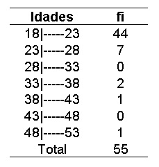
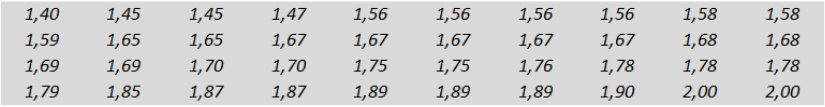

[Inglês](descriptions.md) | Português

# Descriptions

### Sumário

  - [`GeneralCalculationContinuousSets`](#generalcalculationcontinuoussets)
  - [`GeneralCalculationDiscreteSets`](#generalcalculationdiscretesets)
  - [`OrganizeClass`](#organizeclass)
  - [`Fi`](#fi)
  - [`Fir`](#fir)
  - [`Fac`](#fac)
  - [`Fad`](#fad)
  - [`Facr`](#facr)
  - [`Fadr`](#fadr)
  - [`MidPoint`](#midpoint)
  - [`GranMidPoint`](#granmidpoint)
  - [`FullRange`](#fullrange)
  - [`ClassBreadth`](#classbreadth)
  - [`Mean`](#mean)
  - [`Mode`](#mode)
  - [`Median`](#median)
  - [`SampleQtt`](#sampleqtt)
  - [`GranMean`](#granmean)
  - [`GranMode`](#granmode)
  - [`GranMedian`](#granmedian)
  - [`Variance`](#variance)
  - [`StandardDeviation`](#standarddeviation)
  - [`CoefficientVariation`](#coefficientvariation)

## `GeneralCalculationContinuousSets`

Esta função faz todos os cálculos possíveis da biblioteca voltados para conjuntos de dados contínuos, grandes ou pequenos, e retorna todos os valores em uma lista. É possível escolher se quer ou não imprimir os resultados na saída de dados.

### Parâmetros:

- `set: list`: Conjunto de dados como está na tabela de classes.
- `fi: list`: Frequência absoluta (simples) do conjunto de dados.
- `printData: bool` (opcional): Este é responsável por ditar se a função irá imprimir ou não os resultados. Por padrão ele é setado como `False`.

Exemplo de uma tabela de classes:

As classes são representadas pela coluna Idades e os dados passados no parâmetro `set` vão ficar assim:

`[18,23,23,28,28,33,33,38,38,43,43,48,48,53]`

Assim eles serão organizados por uma [outra função](#organizeclass) e ficarão assim:

`[[18,23],[23,28],[28,33],[33,38],[38,43],[43,48],[48,53]]`

## `GeneralCalculationDiscreteSets`

Esta função tem o mesmo propósito da anterior, porém o foco dela é para conjuntos de dados discretos, grandes ou pequenos. Também é possível escolher se a função vai imprimir os dados quando for executada.

### Parâmetros:

- `set: list`: Aqui é onde vai o conjunto de dados. Diferente da função anterior, esta não recebe dados da tabela de classes.
- `printData: bool` (opcional): Este é responsável por ditar se a função irá imprimir ou não os resultados. Por padrão ele é setado como `False`.

Exemplo de conjunto de dados discreto:

Os dados que serão passados no parâmetro `set` são todos os da imagem acima. Eles ficariam dentro de um vetor assim como o da função anterior.

## `OrganizeClass`

Esta função tem o propósito de organizar os dados referentes à tabela de classes. Ela recebe uma lista normal com os limites e retorna uma lista com as classes organizadas.

### Parâmetros:

- `classes: list`: Recebe um vetor com os limites das classes da tabela de classes.

Valor recebido:

`[18,23,23,28,28,33,33,38,38,43,43,48,48,53]`

Valor retornado:

`[[18,23],[23,28],[28,33],[33,38],[38,43],[43,48],[48,53]]`

> Aviso: Serve apenas para o propósito de transformar um vetor de limites em um vetor de classes. Se passar um conjunto de dados discretos ela não irá retornar um valor correto para o seu propósito.

## `Fi`

Nesta função é calculada a frequência absoluta (simples) de um conjunto de dados discretos. Há a possibilidade de retornar um vetor com apenas as frequências absolutas ou um vetor com os valores e suas respectivas frequências.

### Parâmetros:

- `set: list`: Aqui é inserido o conjunto de dados bruto. Tem que ser passado em forma de `list`.
- `respectiveValues: bool`: Esta opção permite fazer a alternancia entre o retorno de dados, possibilitando retornar um vetor com apenas as frequências absolutas (`False` por padrão) ou os valores com suas respectivas frequências (`True`).

## `Fir`

Função que calcula a frequência relativa do conjunto de dados discretos ou das classes, com base na frequência absoluta. O retorno é uma lista com números do tipo `float`.

### Parâmetros:

- `fi: list`: Recebe a frequência absoluta do conjunto de dados discretos ou do conjunto de dados contínuos.

## `Fac`

Esta é a função para calcular as frequências acumuladas de forma crescente. Ela usa como base a lista de frequências absolutas.

### Parâmetros:

- `fi: list`: Assim como a função anterior, ela recebe a lista com as frequências absolutas do conjunto de dados discretos ou contínuos.

## `Fad`

Assim como a função de cálculo de frequências acumuladas, esta também tem esse propósito, mas de forma decrescente.

### Parâmetros:

- `fi: list`: Recebe a lista de frequências absolutas do conjunto de dados discretos ou contínuos.

## `Facr`

Esta função faz o cálculo das frequências relativas acumuladas de forma crescente.

### Parâmetros:

- `fir: list`: É recebida a lista de frequências relativas do conjunto de dados discretos ou contínuos.

## `Fadr`

Tem o mesmo propósito da função anterior, mas o cálculo das frequências relativas acumuladas é de forma decrescente.

### Parâmetros:

- `fir: list`: Aqui é passado a lista de frequências relativas do conjunto de dados discretos ou contínuos.

## `MidPoint`

Esta função faz a coleta dos pontos médios (valores da variável) de um conjunto de dados discretos.

> Aviso: Não funciona para tabela de classes (conjunto de dados contínuos), pois o foco é para um conjunto de dados discretos.

### Parâmetros:

- `set: list`: Recebe uma lista com o conjunto de dados discretos.

## `GranMidPoint`

Esta tem o mesmo propósito da função anterior, porém é usada para tabela de classes (conjunto de dados contínuos).

> Aviso: Não funciona para conjunto de dados discretos, pois o foco é para classes de uma tabela de classes (conjunto de dados contínuos).

### Parâmetros:

- `classes: list`: Recebe uma lista com os limites das classes já organizados (Veja [aqui](#organizeclass) a função para organizar as classes) e retorna uma lista com os pontos médios de cada classe.

## `FullRange`

Função responsável por calcular a amplitude total do conjunto de dados discretos ou das classes de um conjunto de dados contínuos.

### Parâmetros:

- `classes: list`: Recebe uma lista com os limites das classes já organizados (Veja [aqui](#organizeclass) a função para organizar as classes) ou um conjunto de dados discretos.
- `simple: bool` (`False` por padrão): Este parâmetro é quem dita se o que vai ser passado é um conjunto de dados discretos (`True`) ou uma lista com os limites das classes (`False`).

## `ClassBreadth`

Função responsável por calcular a amplitude de classe de um conjunto de dados discretos ou das classes (conjunto de dados contínuos).

### Parâmetros:

- `fullRange: float`: Recebe o resultado do cálculo da [amplitude total](#fullrange).
- `classes: list`: Recebe o conjunto de dados discretos ou uma lista com os limites das classes já organizados (Veja [aqui](#organizeclass) a função para organizar as classes).
- `simple: bool` (`False` por padrão): Dita se o parâmetro anterior vai ser um conjunto de dados discretos (`True`) ou uma lista com os limites das classes (`False`).

## `Mean`

Função que calcula a média de um conjunto de dados discretos.

> Aviso: Não funciona para lista de limites de classes (conjunto de dados contínuos), pois o foco é para conjunto de dados discretos.

### Parâmetros:

- `set: list`: Recebe a lista com os dados do conjunto.

## `Mode`

Função que calcula a moda de um conjunto de dados discretos.

> Aviso: Não funciona para lista de limites de classes (conjunto de dados contínuos), pois o foco é para conjunto de dados discretos.

### Parâmetros:

- `set: list`: Recebe a lista dos dados do conjunto de dados.

## `Median`

Função que calcula a mediana de um conjunto de dados discretos.

> Aviso: Não funciona para lista de limites de classes (conjunto de dados contínuos), pois o foco é para conjunto de dados discretos.

### Parâmetros:

- `set: list`: Recebe a lista com os dados do conjunto de dados.

## `SampleQtt`

Função que calcula o total de amostras com base na frequência absoluta de uma tabela de classes ou no tamanho de um conjunto de dados discretos.

### Parâmetros:

- `set: list`: Recebe o conjunto de dados discretos ou a lista das frequências absolutas da tabela de classes.
- `simple: bool` (`False` por padrão): Dita se o que vai ser recebido no parâmetro anterior é um conjunto de dados discretos (`True`) ou a lista das frequências absolutas da tabela de classes (`False`).

## `GranMean`

Esta função calcula a média de um conjunto de dados contínuos (tabela de classes).

> Aviso: Não funciona para um conjunto de dados discretos, pois o foco é voltado para conjunto de dados contínuos (tabela de classes).

### Parâmetros:

- `midPoint: list`: Recebe a lista com os pontos médios da tabela de classes calculado na [nessa função](#granmidpoint).
- `fi: list`: Recebe a lista com as frequências absolutas da tabela de classes.
- `sampleQtt: int`: Recebe a quantidade de amostras da tabela de classes calculada [nesta função](#sampleqtt).

## `GranMode`

Função que calcula a moda de um conjunto de dados contínuos (tabela de classes).

> Aviso: Não funciona para um conjunto de dados discretos, pois o foco é voltado para conjunto de dados contínuos (tabela de classes).

### Parâmetros:

- `classes: list`: Recebe uma lista com os limites de classes organizados (Veja [aqui](#organizeclass) a função para organizar as classes).
- `fi: list`: Recebe uma lista com as frequências absolutas da tabela de classes. 
- `classBreadth: float`: Recebe o resultado do cálculo da [amplitude de classe](#classbreadth).

## `GranMedian`

Função que calcula a mediana de um conjunto de dados contínuos (tabela de classes).

> Aviso: Não funciona para um conjunto de dados discretos, pois o foco é voltado para conjunto de dados contínuos (tabela de classes).

### Parâmetros:

- `classes: list`: Recebe a lista com os limites das classes organizados (Veja [aqui](#organizeclass) a função para organizar as classes).
- `fi: list`: Aqui é passado a lista com as frequências absolutas da tabela de classes.
- `fac: list`: Aqui é passado a lista com as frequências acumuladas da tabela de classes.
- `classBreadth`: Recebe o resultado do cálculo da [amplitude de classe](#classbreadth).

## `Variance`

Esta função calcula a variância de conjuntos de dados discretos e contínuos.

### Parâmetros:

- `midPoint: list`: Recebe a lista com os midpoints do conjunto de dados discretos ou da tabela de classes.
- `fi: list`: Recebe a lista com as frequências absolutas da tabela de classes.
- `mean: float`: Aqui é passada a média do conjunto de dados discreto ou da tabela de classes calculada.
- `sampleQtt: int`: Aqui é passado o total de amostras do conjunto de dados discretos ou da tabela de classes.
- `simple: bool` (`False` por padrão): Este parâmetro define se o cálculo será para um conjunto de dados discreto ou contínuo.

## `StandardDeviation`

Esta função calcula o desvio padrão do conjunto de dados discreto ou da tabela de classes.

### Parâmetros:

- `varianceResult: float`: Recebe o resultado do cálculo da variância.

## `CoefficientVariation`

Esta função calcula o coeficiente de variação de um conjunto de dados discreto ou da tabela de classes.

### Parâmetros:

- `stanDevResult: float`: Recebe o resultado do cálculo do desvio padrão.
- `mean: float`: Recebe a média do conjunto de dados discreto ou da tabela de classes.

