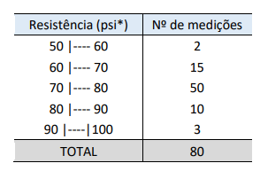

[Inglês](descriptions.md) | Português

# Descriptions

## Introdução

Este arquivo tem como objetivo esclarecer sobre o funcionamento de cada função da biblioteca, de modo que o desenvolvedor tire todas as suas dúvidas. Caso você tenha lido o documento e mesmo assim não tenha entendido algo ou tenha encontrado algum problema, por favor, abra uma nova [issue](https://github.com/dayonoliveira/Statistic/issues) relatando o problema ou dúvida.

Em cada função terá exemplos de como elas funcionam. Os exemplos serão baseados em dois conjuntos de dados tirados de uma lista de exercícios da disciplina Métodos Quantitativos em Computação, do curso de Ciência da Computação da Universidade de Fortaleza.

1. Conjunto de dados discretos:
    - Imagem do conjunto - Questão 8:
        
        
        
    - Lista do conjunto:
        - `[1,3,-2,2,4,2,5,-2,4,3]`
2. Conjunto de dados contínuos:
    - Imagem do conjunto (tabela de classes) - Questão 9:
        
        
        
    - Lista de classes (não organizada):
        - `[50,60,60,70,70,80,80,90,90,100]`
    - Lista das frequências absolutas:
        - `[2,15,50,10,3]`

### Sumário

  - [`GenCalcContinuousSets`](#gencalccontinuoussets)
  - [`GenCalcDiscreteSets`](#gencalcdiscretesets)
  - [`OrganizeSet`](#organizeset)
  - [`Fi`](#fi)
  - [`Fir`](#fir)
  - [`Fac`](#fac)
  - [`Fad`](#fad)
  - [`Facr`](#facr)
  - [`Fadr`](#fadr)
  - [`VarValues`](#varvalues)
  - [`MidPoints`](#midpoints)
  - [`FullRange`](#fullrange)
  - [`ClassBreadth`](#classbreadth)
  - [`Mean`](#mean)
  - [`Mode`](#mode)
  - [`Median`](#median)
  - [`SampleQtt`](#sampleqtt)
  - [`ContMean`](#contmean)
  - [`ContMode`](#contmode)
  - [`ContMedian`](#contmedian)
  - [`SPTwo`](#sptwo)
  - [`SD`](#sd)
  - [`CV`](#cv)


## `GenCalcContinuousSets`

Esta função faz todos os cálculos possíveis da biblioteca voltados para conjuntos de dados contínuos, grandes ou pequenos, e retorna todos os valores em uma lista. É possível escolher se quer ou não imprimir os resultados na saída de dados.

### Parâmetros:

- `set: list`: Conjunto de dados como está na tabela de classes.
- `fi: list`: Frequência absoluta (simples) do conjunto de dados.
- `printData: bool` (opcional): Este é responsável por ditar se a função irá imprimir ou não os resultados. Por padrão ele é setado como `False`.

### Return:

- `resultVector: list`: Retorna uma lista com todos os resultados de todos os cálculos possíveis da biblioteca.
- `print` (Opcional): Há a possibilidade de imprimir os resultados após os cálculos.

### Exemplo:

```python
gen_contSet:list = GenCalcContinuousSets(
  [50,60,60,70,70,80,80,90,90,100],
  [2,15,50,10,3],
  True
)
```

```bash
Classes: [[50, 60], [60, 70], [70, 80], [80, 90], [90, 100]]
Fi: [2, 15, 50, 10, 3]
Fir: [0.025, 0.1875, 0.625, 0.125, 0.0375]
Fac: [2, 17, 67, 77, 80]
Fad: [80, 78, 63, 13, 3]
Facr: [0.025, 0.2125, 0.8375, 0.9625, 1.0]
Fadr: [1.0, 0.975, 0.7875, 0.1625, 0.0375]
Mid points: [55.0, 65.0, 75.0, 85.0, 95.0]
Full range: 50.0
Class breadth: 10.0
Total samples: 80
Mean: 74.62
Mode: [74.67]
Median: 74.6
Variance: 56.82
Standart deviation: 7.54
Coefficient variation: 10.1
```

## `GenCalcDiscreteSets`

Esta função tem o mesmo propósito da anterior, porém o foco dela é para conjuntos de dados discretos, grandes ou pequenos. Também é possível escolher se a função vai imprimir os dados quando for executada.

### Parâmetros:

- `set: list`: Aqui é onde vai o conjunto de dados. Diferente da função anterior, esta não recebe dados da tabela de classes.
- `printData: bool` (opcional): Este é responsável por ditar se a função irá imprimir ou não os resultados. Por padrão ele é setado como `False`.

### Return:

- `resultVector: list`: Retorna uma lista com os resultados de todos os cálculos possíveis da biblioteca.
- `print`: Há também a possibilidade de imprimir os resultados após todos os cálculos.

### Exemplo:

```python
gen_discSet:list = GenCalcDiscreteSets(
  [1,3,-2,2,4,2,5,-2,4,3],
  True
)
```

```bash
Set: [-2, -2, 1, 2, 2, 3, 3, 4, 4, 5]
Fi: [1, 2, 2, 2, 2, 1]
Fir: [0.1, 0.2, 0.2, 0.2, 0.2, 0.1]
Fac: [1, 3, 5, 7, 9, 10]
Fad: [10, 9, 7, 5, 3, 1]
Facr: [0.1, 0.30000000000000004, 0.5, 0.7, 0.8999999999999999, 0.9999999999999999]
Fadr: [0.9999999999999999, 0.8999999999999999, 0.7, 0.5, 0.30000000000000004, 0.1]
Mid points: [1, 3, -2, 2, 4, 5]
Full range: 7.0
Class breadth: 1.4
Total samples: 10
Mean: 2.0
Mode: [-2, 2, 3, 4]
Median: 2.5
Variance: 3.44
Standart deviation: 1.85
Coefficient variation: 92.5
```

## `OrganizeSet`

Esta função tem o propósito de organizar os dados referentes à tabela de classes. Ela recebe uma lista normal com os limites e retorna uma lista com as classes organizadas.

### Parâmetros:

- `classes: list`: Recebe um vetor com os limites das classes da tabela de classes.

### Return:

- `aux: list`: Retorna uma lista com as classes organizadas em pequenos vetores dentro da lista, semelhante a uma tabela de classes.

> Aviso: Serve apenas para o propósito de transformar um vetor de limites em um vetor de classes. Se passar um conjunto de dados discretos ela não irá retornar um valor correto para o seu propósito.

### Exemplo:

```python
organized_classes:list = OrganizeSet(
  [50,60,60,70,70,80,80,90,90,100]
)
print(organized_classes)
```

```bash
[[50, 60], [60, 70], [70, 80], [80, 90], [90, 100]]
```

## `Fi`

Nesta função é calculada a frequência absoluta (simples) de um conjunto de dados discretos. Há a possibilidade de retornar um vetor com apenas as frequências absolutas ou um vetor com os valores e suas respectivas frequências.

### Parâmetros:

- `set: list`: Aqui é inserido o conjunto de dados bruto. Tem que ser passado em forma de `list`.
- `respectiveValues: bool`: Esta opção permite fazer a alternancia entre o retorno de dados, possibilitando retornar um vetor com apenas as frequências absolutas (`False` por padrão) ou os valores com suas respectivas frequências (`True`).

### Return:

- `freq: list`: Retorna uma lista com apenas as frequências absolutas, ou uma lista com as frequências e seus respectivos valores.

### Exemplos:

Forma padrão:
```python
fi:list = Fi([1,3,-2,2,4,2,5,-2,4,3])
print(fi)
```

```bash
[1, 2, 2, 2, 2, 1]
```

Forma com os respectivos valores:
```python
fi:list = Fi([1,3,-2,2,4,2,5,-2,4,3], True)
print(fi)
```

```bash
[[1, 1], [3, 2], [-2, 2], [2, 2], [4, 2], [5, 1]]
```

## `Fir`

Função que calcula a frequência relativa do conjunto de dados discretos ou das classes, com base na frequência absoluta. O retorno é uma lista com números do tipo `float`.

### Parâmetros:

- `fi: list`: Recebe a frequência absoluta do conjunto de dados discretos ou do conjunto de dados contínuos.

### Return:

- `aux: list`: Retorna uma lista com as frequências relativas do conjunto de dados.

### Exemplos:

Conjunto de dados contínuos:
```python
fir:list = Fir([2,15,50,10,3])
print(fir)
```

```bash
[0.025, 0.1875, 0.625, 0.125, 0.0375]
```

Conjunto de dados discretos:
```python
fir:list = Fir([1, 2, 2, 2, 2, 1])
print(fir)
```

```bash
[0.1, 0.2, 0.2, 0.2, 0.2, 0.1]
```

## `Fac`

Esta é a função para calcular as frequências acumuladas de forma crescente. Ela usa como base a lista de frequências absolutas.

### Parâmetros:

- `fi: list`: Assim como a função anterior, ela recebe a lista com as frequências absolutas do conjunto de dados discretos ou contínuos.

### Return:

- `aux: list`: Retorna uma lista com as frequências acumuladas de forma crescente.

### Exemplos:

Conjunto de dados contínuos:
```python
fac:list = Fac([2,15,50,10,3])
print(fac)
```

```bash
[2, 17, 67, 77, 80]
```

Conjunto de dados discretos:
```python
fac:list = Fac([1, 2, 2, 2, 2, 1])
print(fac)
```

```bash
[1, 3, 5, 7, 9, 10]
```

## `Fad`

Assim como a função de cálculo de frequências acumuladas, esta também tem esse propósito, mas de forma decrescente.

### Parâmetros:

- `fi: list`: Recebe a lista de frequências absolutas do conjunto de dados discretos ou contínuos.

### Return:

- `aux: list`: Retorna uma lista com as frequências acumuladas de forma decrescente.

### Exemplos:

Conjunto de dados contínuos:
```python
fad:list = Fad([2,15,50,10,3])
print(fad)
```

```bash
[80, 78, 63, 13, 3]
```

Conjunto de dados discretos:
```python
fad:list = Fad([1, 2, 2, 2, 2, 1])
print(fad)
```

```bash
[10, 9, 7, 5, 3, 1]
```

## `Facr`

Esta função faz o cálculo das frequências relativas acumuladas de forma crescente.

### Parâmetros:

- `fir: list`: É recebida a lista de frequências relativas do conjunto de dados discretos ou contínuos.

### Return:

- `aux: list`: Retorna uma lista com as frequências relativas acumuladas de forma crescente.

### Exemplos:

Conjunto de dados contínuos:
```python
facr:list = Facr([0.025, 0.1875, 0.625, 0.125, 0.0375])
print(facr)
```

```bash
[0.025, 0.2125, 0.8375, 0.9625, 1.0]
```

Conjunto de dados discretos:
```python
facr:list = Facr([0.1, 0.2, 0.2, 0.2, 0.2, 0.1])
print(facr)
```

```bash
[0.1, 0.30000000000000004, 0.5, 0.7, 0.8999999999999999, 0.9999999999999999]
```

## `Fadr`

Tem o mesmo propósito da função anterior, mas o cálculo das frequências relativas acumuladas é de forma decrescente.

### Parâmetros:

- `fir: list`: Aqui é passado a lista de frequências relativas do conjunto de dados discretos ou contínuos.

### Return:

- `aux: list`: Retorna uma lista com as frequências relativas acumuladas de forma decrescente.

### Exemplos:

Conjunto de dados contínuos:
```python
fadr:list = Fadr([0.025, 0.1875, 0.625, 0.125, 0.0375])
print(fadr)
```

```bash
[1.0, 0.975, 0.7875, 0.1625, 0.0375]
```

Conjunto de dados discretos:
```python
fadr:list = Fadr([0.1, 0.2, 0.2, 0.2, 0.2, 0.1])
print(fadr)
```

```bash
[0.9999999999999999, 0.8999999999999999, 0.7, 0.5, 0.30000000000000004, 0.1]
```

## `VarValues`

Esta função faz a coleta dos pontos médios (valores da variável) de um conjunto de dados discretos.

> Aviso: Não funciona para tabela de classes (conjunto de dados contínuos), pois o foco é para um conjunto de dados discretos.

### Parâmetros:

- `set: list`: Recebe uma lista com o conjunto de dados discretos.

### Return:

- `aux: list`: Retorna uma lista com os pontos médios (valores da variável) do conjunto de dados discretos.

### Exemplo:

```python
variable_values:list = VarValues([1,3,-2,2,4,2,5,-2,4,3])
print(variable_values)
```

```bash
[1, 3, -2, 2, 4, 5]
```

## `MidPoints`

Esta tem o mesmo propósito da função anterior, porém é usada para tabela de classes (conjunto de dados contínuos).

> Aviso: Não funciona para conjunto de dados discretos, pois o foco é para classes de uma tabela de classes (conjunto de dados contínuos).

### Parâmetros:

- `classes: list`: Recebe uma lista com os limites das classes já organizados (Veja [aqui](#organizeset) a função para organizar as classes) e retorna uma lista com os pontos médios de cada classe.

### Return:

- `aux: list`: Retorna uma lista com os pontos médios do conjunto de dados contínuos.

### Exemplo:

```python
mid_points:list = MidPoints(
  [[50, 60], [60, 70], [70, 80], [80, 90], [90, 100]]
)
print(mid_points)
```

```bash
[55.0, 65.0, 75.0, 85.0, 95.0]
```

## `FullRange`

Função responsável por calcular a amplitude total do conjunto de dados discretos ou das classes de um conjunto de dados contínuos.

### Parâmetros:

- `classes: list`: Recebe uma lista com os limites das classes já organizados (Veja [aqui](#organizeset) a função para organizar as classes) ou um conjunto de dados discretos.
- `simple: bool` (`False` por padrão): Este parâmetro é quem dita se o que vai ser passado é um conjunto de dados discretos (`True`) ou uma lista com os limites das classes (`False`).

### Return:

- `</>: float`: Retorna um resultado de um cálculo para encontrar a amplitude total.

### Exemplos:

Forma padrão:
```python
full_range:float = FullRange(
  [[50, 60], [60, 70], [70, 80], [80, 90], [90, 100]]
)
print(full_range)
```

```bash
50.0
```

Conjunto de dados discretos:
```python
full_range:float = FullRange(
  [1,3,-2,2,4,2,5,-2,4,3],
  True
)
print(full_range)
```

```bash
7.0
```

## `ClassBreadth`

Função responsável por calcular a amplitude de classe de um conjunto de dados discretos ou das classes (conjunto de dados contínuos).

### Parâmetros:

- `fullRange: float`: Recebe o resultado do cálculo da [amplitude total](#fullrange).
- `classes: list`: Recebe o conjunto de dados discretos ou uma lista com os limites das classes já organizados (Veja [aqui](#organizeset) a função para organizar as classes).
- `simple: bool` (`False` por padrão): Dita se o parâmetro anterior vai ser um conjunto de dados discretos (`True`) ou uma lista com os limites das classes (`False`).

### Return:

- `</>: float`: Retorna o resultado de um cálculo para encontrar a amplitude de classe.

### Exemplos:

Forma padrão:
```python
class_breadth:float = ClassBreadth(
  50.0,
  [[50, 60], [60, 70], [70, 80], [80, 90], [90, 100]]
)
print(class_breadth)
```

```bash
10.0
```

Conjunto de dados discretos:
```python
class_breadth:float = ClassBreadth(
  7.0,
  [1,3,-2,2,4,2,5,-2,4,3],
  True
)
print(class_breadth)
```

```bash
1.4
```

## `Mean`

Função que calcula a média de um conjunto de dados discretos.

> Aviso: Não funciona para lista de limites de classes (conjunto de dados contínuos), pois o foco é para conjunto de dados discretos.

### Parâmetros:

- `set: list`: Recebe a lista com os dados do conjunto.

### Return:

- `aux: float`: Retorna a média de um conjunto de dados discretos.

### Exemplo:

```python
mean:float = Mean([1,3,-2,2,4,2,5,-2,4,3])
print(mean)
```

```bash
2.0
```

## `Mode`

Função que calcula a moda de um conjunto de dados discretos.

> Aviso: Não funciona para lista de limites de classes (conjunto de dados contínuos), pois o foco é para conjunto de dados discretos.

### Parâmetros:

- `set: list`: Recebe a lista dos dados do conjunto de dados.

### Return:

- `mostRepeatingValue: list`: Retorna uma lista com todas as modas de um conjunto de dados discretos.

### Exemplo:

```python
mode:list = Mode([1,3,-2,2,4,2,5,-2,4,3])
print(mode)
```

```bash
[-2, 2, 3, 4]
```

## `Median`

Função que calcula a mediana de um conjunto de dados discretos.

> Aviso: Não funciona para lista de limites de classes (conjunto de dados contínuos), pois o foco é para conjunto de dados discretos.

### Parâmetros:

- `set: list`: Recebe a lista com os dados do conjunto de dados.

### Return:

- `aux: float`: Retorna a mediana de um conjunto de dados discretos.

### Exemplo:

```python
median:float = Median([1,3,-2,2,4,2,5,-2,4,3])
print(median)
```

```bash
2.5
```

## `SampleQtt`

Função que calcula o total de amostras com base na frequência absoluta de uma tabela de classes ou no tamanho de um conjunto de dados discretos.

### Parâmetros:

- `setOrFi: list`: Recebe o conjunto de dados discretos ou a lista das frequências absolutas da tabela de classes.
- `simple: bool` (`False` por padrão): Dita se o que vai ser recebido no parâmetro anterior é um conjunto de dados discretos (`True`) ou a lista das frequências absolutas da tabela de classes (`False`).

### Return:

- `#: int`: Retorna a quantidade de amostras de um conjunto de dados discretos ou contínuos.

### Exemplos:

Usando as frequências absolutas do conjunto de dados contínuos:
```python
sample_qtt:int = SampleQtt([2, 15, 50, 10, 3])
print(sample_qtt)
```

```bash
80
```

Usando a lista do conjunto de dados discretos:
```python
sample_qtt:int = SampleQtt(
  [1,3,-2,2,4,2,5,-2,4,3],
  True
)
print(sample_qtt)
```

```bash
10
```

## `ContMean`

Esta função calcula a média de um conjunto de dados contínuos (tabela de classes).

> Aviso: Não funciona para um conjunto de dados discretos, pois o foco é voltado para conjunto de dados contínuos (tabela de classes).

### Parâmetros:

- `midPoint: list`: Recebe a lista com os pontos médios da tabela de classes calculado na [nessa função](#midpoints).
- `fi: list`: Recebe a lista com as frequências absolutas da tabela de classes.
- `sampleQtt: int`: Recebe a quantidade de amostras da tabela de classes calculada [nesta função](#sampleqtt).

### Return:

- `</>: float`: Retorna o resultado de um cálculo para encontrar a média do conjunto de dados contínuos.

### Exemplo:

```python
cont_mean:float = ContMean(
  [55.0, 65.0, 75.0, 85.0, 95.0],
  [2, 15, 50, 10, 3],
  80
)
print(cont_mean)
```

```bash
74.62
```

## `ContMode`

Função que calcula a moda de um conjunto de dados contínuos (tabela de classes).

> Aviso: Não funciona para um conjunto de dados discretos, pois o foco é voltado para conjunto de dados contínuos (tabela de classes).

### Parâmetros:

- `classes: list`: Recebe uma lista com os limites de classes organizados (Veja [aqui](#organizeset) a função para organizar as classes).
- `fi: list`: Recebe uma lista com as frequências absolutas da tabela de classes. 
- `classBreadth: float`: Recebe o resultado do cálculo da [amplitude de classe](#classbreadth).

### Return:

- `modes: list`: Retorna uma lista com todas as modas do conjunto de dados contínuos.

### Exemplo:

```python
cont_mode:list = ContMode(
  [[50, 60], [60, 70], [70, 80],
  [80, 90], [90, 100]],
  [2, 15, 50, 10, 3],
  10.0
)
print(cont_mode)
```

```bash
[74.67]
```

## `ContMedian`

Função que calcula a mediana de um conjunto de dados contínuos (tabela de classes).

> Aviso: Não funciona para um conjunto de dados discretos, pois o foco é voltado para conjunto de dados contínuos (tabela de classes).

### Parâmetros:

- `classes: list`: Recebe a lista com os limites das classes organizados (Veja [aqui](#organizeset) a função para organizar as classes).
- `fi: list`: Aqui é passado a lista com as frequências absolutas da tabela de classes.
- `fac: list`: Aqui é passado a lista com as frequências acumuladas da tabela de classes.
- `classBreadth`: Recebe o resultado do cálculo da [amplitude de classe](#classbreadth).

### Return:

- `median: float`: Retorna a mediana de um conjunto de dados contínuos.

### Exemplo:

```python
cont_median:float = ContMedian(
  [[50, 60], [60, 70], [70, 80], [80, 90], [90, 100]],
  [2, 15, 50, 10, 3],
  [2, 17, 67, 77, 80],
  10.0
)
print(cont_median)
```

```bash
74.6
```

## `SPTwo`

Esta função calcula a variância de conjuntos de dados discretos e contínuos.

### Parâmetros:

- `midPoint: list`: Recebe a lista com os midpoints do conjunto de dados discretos ou da tabela de classes.
- `fi: list`: Recebe a lista com as frequências absolutas da tabela de classes.
- `mean: float`: Aqui é passada a média do conjunto de dados discreto ou da tabela de classes calculada.
- `sampleQtt: int`: Aqui é passado o total de amostras do conjunto de dados discretos ou da tabela de classes.
- `simple: bool` (`False` por padrão): Este parâmetro define se o cálculo será para um conjunto de dados discreto ou contínuo.

### Return:

- `</>: float`: Retorna o resultado de um cálculo para encontrar a variância de um conjunto de dados discretos ou contínuos.

### Exemplos:

Forma padrão:
```python
variance:float = SPTwo(
  [55.0, 65.0, 75.0, 85.0, 95.0],
  [2, 15, 50, 10, 3],
  74.62,
  80
)
print(variance)
```

```bash
56.82
```

Conjunto de dados discretos:
```python
variance:float = SPTwo(
  [1, 3, -2, 2, 4, 5],
  [1, 2, 2, 2, 2, 1],
  2.0,
  10,
  True
)
print(variance)
```

```bash
3.44
```

## `SD`

Esta função calcula o desvio padrão do conjunto de dados discreto ou da tabela de classes.

### Parâmetros:

- `varianceResult: float`: Recebe o resultado do cálculo da variância.

### Return:

- `</>: float`: Retorna o resultado de um cálculo para encontrar o desvio padrão de um conjunto de dados discretos ou contínuos.

### Exemplos:

Conjunto de dados contínuos:
```python
standard_deviation:float = SD(56.82)
print(standard_deviation)
```

```bash
7.54
```

Conjunto de dados discretos:
```python
standard_deviation:float = SD(3.44)
print(standard_deviation)
```

```bash
1.85
```

## `CV`

Esta função calcula o coeficiente de variação de um conjunto de dados discreto ou da tabela de classes.

### Parâmetros:

- `stanDevResult: float`: Recebe o resultado do cálculo do desvio padrão.
- `mean: float`: Recebe a média do conjunto de dados discreto ou da tabela de classes.

### Return:

- `</>: float`: Retorna o resultado de um cálculo para encontrar o coeficiente de variação de um conjunto de dados discretos ou contínuos.

### Exemplos:

Conjunto de dados contínuos:
```python
coefficient_variation:float = CV(7.54, 74.62)
print(coefficient_variation)
```

```bash
10.1
```

Conjunto de dados discretos:
```python
coefficient_variation:float = CV(1.85, 2.0)
print(coefficient_variation)
```

```bash
92.5
```