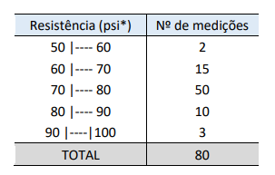

# Módulo `continuous.py`

## Introdução

Este arquivo tem como objetivo esclarecer sobre o funcionamento de cada função do módulo `continuous.py`, de modo que o desenvolvedor tire todas as suas dúvidas. Caso você tenha lido o documento e mesmo assim não tenha entendido algo ou tenha encontrado algum problema, por favor, abra uma nova [issue](https://github.com/dayonoliveira/Statistic/issues) relatando o problema ou dúvida.

Em cada função terá exemplos de como elas funcionam. Os exemplos serão baseados em um conjunto de dados tirado de uma lista de exercícios da disciplina Métodos Quantitativos em Computação, do curso de Ciência da Computação da Universidade de Fortaleza.


- Conjunto de dados contínuos:
  - Imagem do conjunto (tabela de classes) - Questão 9:
      
      
      
  - Lista de classes (não organizada):
      - `[50,60,60,70,70,80,80,90,90,100]`
  - Lista das frequências absolutas:
      - `[2,15,50,10,3]`

### Sumário

  - [`fir`](#fir)
  - [`fac`](#fac)
  - [`fad`](#fad)
  - [`facr`](#facr)
  - [`fadr`](#fadr)
  - [`mid_points`](#midpoints)
  - [`full_range`](#fullrange)
  - [`class_breadth`](#classbreadth)
  - [`sample_qtt`](#sampleqtt)
  - [`max_min`](#maxmin)
  - [`mean`](#contmean)
  - [`mode`](#contmode)
  - [`median`](#contmedian)
  - [`percentile`](#percentile)
  - [`quartiles`](#quartiles)
  - [`variance`](#sptwo)
  - [`sd`](#sd)
  - [`cv`](#cv)
  - [`organize_set`](#organizeset)
  - [`gen_calc_continuous_sets`](#gencalccontinuoussets)


## `fir`

Função que calcula a frequência relativa das classes, com base na frequência absoluta. O retorno é uma lista com números do tipo `float`.

### Parâmetros:

- `fi: list`: Recebe a frequência absoluta do conjunto de dados contínuos.

### Return:

- `aux: list`: Retorna uma lista com as frequências relativas do conjunto de dados.

### Exemplo:

```python
fr:list = fir([2,15,50,10,3])
print(fr)
```

```bash
[0.025, 0.1875, 0.625, 0.125, 0.0375]
```

## `fac`

Esta é a função para calcular as frequências acumuladas de forma crescente. Ela usa como base a lista de frequências absolutas.

### Parâmetros:

- `fi: list`: Assim como a função anterior, ela recebe a lista com as frequências absolutas do conjunto de dados contínuos.

### Return:

- `aux: list`: Retorna uma lista com as frequências acumuladas de forma crescente.

### Exemplo:

```python
fc:list = fac([2,15,50,10,3])
print(fc)
```

```bash
[2, 17, 67, 77, 80]
```

## `fad`

Assim como a função de cálculo de frequências acumuladas, esta também tem esse propósito, mas de forma decrescente.

### Parâmetros:

- `fi: list`: Recebe a lista de frequências absolutas do conjunto de dados contínuos.

### Return:

- `aux: list`: Retorna uma lista com as frequências acumuladas de forma decrescente.

### Exemplo:

```python
fd:list = fad([2,15,50,10,3])
print(fd)
```

```bash
[80, 78, 63, 13, 3]
```

## `facr`

Esta função faz o cálculo das frequências relativas acumuladas de forma crescente.

### Parâmetros:

- `fir: list`: É recebida a lista de frequências relativas do conjunto de dados contínuos.

### Return:

- `aux: list`: Retorna uma lista com as frequências relativas acumuladas de forma crescente.

### Exemplo:

```python
fcr:list = facr([0.025, 0.1875, 0.625, 0.125, 0.0375])
print(fcr)
```

```bash
[0.025, 0.2125, 0.8375, 0.9625, 1.0]
```

## `fadr`

Tem o mesmo propósito da função anterior, mas o cálculo das frequências relativas acumuladas é de forma decrescente.

### Parâmetros:

- `fir: list`: Aqui é passado a lista de frequências relativas do conjunto de dados contínuos.

### Return:

- `aux: list`: Retorna uma lista com as frequências relativas acumuladas de forma decrescente.

### Exemplo:

```python
fdr:list = fadr([0.025, 0.1875, 0.625, 0.125, 0.0375])
print(fdr)
```

```bash
[1.0, 0.975, 0.7875, 0.1625, 0.0375]
```

## `mid_points`

Esta tem o mesmo propósito da função anterior, porém é usada para tabela de classes (conjunto de dados contínuos).

### Parâmetros:

- `classes: list`: Recebe uma lista com os limites das classes já organizados (Veja [aqui](#organizeset) a função para organizar as classes) e retorna uma lista com os pontos médios de cada classe.

### Return:

- `aux: list`: Retorna uma lista com os pontos médios do conjunto de dados contínuos.

### Exemplo:

```python
mid_p:list = mid_points(
  [[50, 60], [60, 70], [70, 80], [80, 90], [90, 100]]
)
print(mid_p)
```

```bash
[55.0, 65.0, 75.0, 85.0, 95.0]
```

## `full_range`

Função responsável por calcular a amplitude total das classes de um conjunto de dados contínuos.

### Parâmetros:

- `classes: list`: Recebe uma lista com os limites das classes já organizados (Veja [aqui](#organizeset) a função para organizar as classes).

### Return:

- `</>: float`: Retorna um resultado de um cálculo para encontrar a amplitude total.

### Exemplo:

```python
f_r:float = full_range(
  [[50, 60], [60, 70], [70, 80], [80, 90], [90, 100]]
)
print(f_r)
```

```bash
50.0
```

## `class_breadth`

Função responsável por calcular a amplitude de classe de conjunto de dados contínuos.

### Parâmetros:

- `fullRange: float`: Recebe o resultado do cálculo da [amplitude total](#fullrange).
- `classes: list`: Recebe uma lista com os limites das classes já organizados (Veja [aqui](#organizeset) a função para organizar as classes).

### Return:

- `</>: float`: Retorna o resultado de um cálculo para encontrar a amplitude de classe.

### Exemplo:

```python
class_b:float = class_breadth(
  50.0,
  [[50, 60], [60, 70], [70, 80], [80, 90], [90, 100]]
)
print(class_b)
```

```bash
10.0
```

## `sample_qtt`

Função que calcula o total de amostras com base na frequência absoluta de uma tabela de classes.

### Parâmetros:

- `fi: list`: Recebe a lista das frequências absolutas da tabela de classes.

### Return:

- `#: int`: Retorna a quantidade de amostras de um conjunto de dados contínuos.

### Exemplo:

```python
sample_q:int = sample_qtt([2, 15, 50, 10, 3])
print(sample_q)
```

```bash
80
```

## `max_min`

Esta função capta os pontos máximo e mínimo de um conjunto de dados contínuos.

### Parâmetros:

- `set: list`: Recebe uma lista com o conjunto de dados contínuos.

### Return:

- `max_min: list`: Retorna uma lista de duas posições onde a primeira é referente ao ponto mínimo do conjunto e a segunda é o ponto máximo do conjunto.

### Exemplo:

```python
mx_mn:list = max_min([[50, 60], [60, 70], [70, 80], [80, 90], [90, 100]])
print(mx_mn)
```

```bash
[50, 100]
```

## `mean`

Esta função calcula a média de um conjunto de dados contínuos (tabela de classes).

### Parâmetros:

- `mid_point: list`: Recebe a lista com os pontos médios da tabela de classes calculado na [nessa função](#midpoints).
- `fi: list`: Recebe a lista com as frequências absolutas da tabela de classes.
- `sample_qtt: int`: Recebe a quantidade de amostras da tabela de classes calculada [nesta função](#sampleqtt).

### Return:

- `</>: float`: Retorna o resultado de um cálculo para encontrar a média do conjunto de dados contínuos.

### Exemplo:

```python
average:float = mean(
  [55.0, 65.0, 75.0, 85.0, 95.0],
  [2, 15, 50, 10, 3],
  80
)
print(average)
```

```bash
74.62
```

## `mode`

Função que calcula a moda de um conjunto de dados contínuos (tabela de classes).

### Parâmetros:

- `classes: list`: Recebe uma lista com os limites de classes organizados (Veja [aqui](#organizeset) a função para organizar as classes).
- `fi: list`: Recebe uma lista com as frequências absolutas da tabela de classes. 
- `class_breadth: float`: Recebe o resultado do cálculo da [amplitude de classe](#classbreadth).

### Return:

- `modes: list`: Retorna uma lista com todas as modas do conjunto de dados contínuos.

### Exemplo:

```python
mod:list = mode(
  [[50, 60], [60, 70], [70, 80],
  [80, 90], [90, 100]],
  [2, 15, 50, 10, 3],
  10.0
)
print(mod)
```

```bash
[74.67]
```

## `median`

Função que calcula a mediana de um conjunto de dados contínuos (tabela de classes).

### Parâmetros:

- `classes: list`: Recebe a lista com os limites das classes organizados (Veja [aqui](#organizeset) a função para organizar as classes).
- `fi: list`: Aqui é passado a lista com as frequências absolutas da tabela de classes.
- `fac: list`: Aqui é passado a lista com as frequências acumuladas da tabela de classes.
- `class_breadth`: Recebe o resultado do cálculo da [amplitude de classe](#classbreadth).

### Return:

- `median: float`: Retorna a mediana de um conjunto de dados contínuos.

### Exemplo:

```python
med:float = median(
  [[50, 60], [60, 70], [70, 80], [80, 90], [90, 100]],
  [2, 15, 50, 10, 3],
  [2, 17, 67, 77, 80],
  10.0
)
print(med)
```

```bash
74.6
```

## `percentile`

Tem como objetivo calcular o valor do percentil passado pelo usuário.

### Parâmetros:

- `percentile: int`: Recebe o percentil a ser calculado.
- `set: list`: Recebe a lista do conjunto de dados continuos.
- `fi: list`: Recebe a lista de frequências absolutas do conjunto de dados.
- `fac: list`: Recebe a lista de frequências acumuladas de forma crescente do conjunto de dados.
- `class_breadth: float`: Recebe a amplitude de classes.

### Return:

- `perc_result: float`: Retorna o valor referente ao percentil passado como parâmetro.

### Exemplo:

```python
perc:float = percentile(23, [[50, 60], [60, 70], [70, 80], [80, 90], [90, 100]], [2, 15, 50, 10, 3], [2, 17, 67, 77, 80], 10.0)
print(perc)
```

```bash
70.28
```
## `quartiles`

Esta função é responsável por calcular os quartis de um conjunto de dados contínuos.

### Parâmetros:

- `set: list`: Recebe o conjunto de dados contínuos.
- `fi: list`: Recebe uma lista com as frequências absolutas do conjunto de dados contínuos.
- `fac: list`: Recebe uma lista com as frequências acumuladas crescentes do conjunto de dados contínuos.
- `class_breadth: float`: Recebe a amplitude de classe.

### Return:

- `quartile: list`: Retorna uma lista de cinco posições, onde:
  - i0 = Q0 (0%)
  - i1 = Q1 (25%)
  - i2 = Q2 (50%)
  - i3 = Q3 (75%)
  - i4 = Q4 (100%)

### Exemplo:

```python
quart:list = quartiles(
  [[50, 60], [60, 70], [70, 80], [80, 90], [90, 100]],
  [2, 15, 50, 10, 3],
  [2, 17, 67, 77, 80],
  10.0
)
print(quart)
```

```bash
[50, 70.6, 74.6, 78.6, 100]
```

## `variance`

Esta função calcula a variância de conjuntos de dados contínuos.

### Parâmetros:

- `mid_point: list`: Recebe a lista com os midpoints do conjunto de dados contínuos.
- `fi: list`: Recebe a lista com as frequências absolutas.
- `mean: float`: Aqui é passada a média do conjunto de dados contínuos.
- `sample_qtt: int`: Aqui é passado o total de amostras do conjunto de dados contínuos.

### Return:

- `</>: float`: Retorna o resultado de um cálculo para encontrar a variância de um conjunto de dados contínuos.

### Exemplo:

```python
var:float = variance(
  [55.0, 65.0, 75.0, 85.0, 95.0],
  [2, 15, 50, 10, 3],
  74.62,
  80
)
print(var)
```

```bash
56.82
```

## `sd`

Esta função calcula o desvio padrão da tabela de classes.

### Parâmetros:

- `variance_result: float`: Recebe o resultado do cálculo da variância.

### Return:

- `</>: float`: Retorna o resultado de um cálculo para encontrar o desvio padrão de um conjunto de dados contínuos.

### Exemplo:

```python
standard_deviation:float = sd(56.82)
print(standard_deviation)
```

```bash
7.54
```

## `cv`

Esta função calcula o coeficiente de variação da tabela de classes.

### Parâmetros:

- `stan_dev_result: float`: Recebe o resultado do cálculo do desvio padrão.
- `mean: float`: Recebe a média da tabela de classes.

### Return:

- `</>: float`: Retorna o resultado de um cálculo para encontrar o coeficiente de variação de um conjunto de dados contínuos.

### Exemplo:

```python
coefficient_variation:float = cv(7.54, 74.62)
print(coefficient_variation)
```

```bash
10.1
```

## `organize_set`

Esta função tem o propósito de organizar os dados referentes à tabela de classes. Ela recebe uma lista normal com os limites e retorna uma lista com as classes organizadas.

### Parâmetros:

- `classes: list`: Recebe um vetor com os limites das classes da tabela de classes.

### Return:

- `aux: list`: Retorna uma lista com as classes organizadas em pequenos vetores dentro da lista, semelhante a uma tabela de classes.

### Exemplo:

```python
organized_classes:list = organize_set(
  [50,60,60,70,70,80,80,90,90,100]
)
print(organized_classes)
```

```bash
[[50, 60], [60, 70], [70, 80], [80, 90], [90, 100]]
```

## `gen_calc_continuous_sets`

Esta função faz todos os cálculos possíveis da biblioteca voltados para conjuntos de dados contínuos, grandes ou pequenos, e retorna todos os valores em uma lista. É possível escolher se quer ou não imprimir os resultados na saída de dados.

### Parâmetros:

- `set: list`: Conjunto de dados como está na tabela de classes.
- `fi: list`: Frequência absoluta (simples) do conjunto de dados.
- `print_data: bool` (opcional): Este é responsável por ditar se a função irá imprimir ou não os resultados. Por padrão ele é setado como `False`.

### Return:

- `result_vector: list`: Retorna uma lista com todos os resultados de todos os cálculos possíveis da biblioteca.
- `print` (Opcional): Há a possibilidade de imprimir os resultados após os cálculos.

### Exemplo:

```python
gen_cont_set:list = gen_calc_continuous_sets(
  [50,60,60,70,70,80,80,90,90,100],
  [2,15,50,10,3],
  True
)
```

```bash
Classes: [[50, 60], [60, 70], [70, 80], [80, 90], [90, 100]]
Fi: [2, 15, 50, 10, 3]
Fir: [0.025, 0.1875, 0.625, 0.125, 0.0375]
Fac: [2, 17, 67, 77, 80]
Fad: [80, 78, 63, 13, 3]
Facr: [0.025, 0.2125, 0.8375, 0.9625, 1.0]
Fadr: [1.0, 0.975, 0.7875, 0.1625, 0.0375]
Mid points: [55.0, 65.0, 75.0, 85.0, 95.0]
Full range: 50.0
Class breadth: 10.0
Total samples: 80
Min: 50 | Max: 100
Mean: 74.62
Mode: 74.66666666666667
Median: 74.6
Q0: 50 | Q1: 70.6 | Q2: 74.6 | Q3: 78.6 | Q4: 100
Variance: <function variance at 0x000001A05721A550>
Standard deviation: 7.5378807081049155
Coefficient variation: 10.101689504294981
```