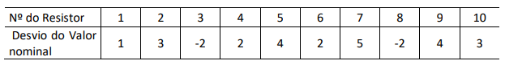

# Módulo `discrete.py`

## Introdução

Este arquivo tem como objetivo esclarecer sobre o funcionamento de cada função do módulo `discrete.py`, de modo que o desenvolvedor tire todas as suas dúvidas. Caso você tenha lido o documento e mesmo assim não tenha entendido algo ou tenha encontrado algum problema, por favor, abra uma nova [issue](https://github.com/dayonoliveira/Statistic/issues) relatando o problema ou dúvida.

Em cada função terá exemplos de como elas funcionam. Os exemplos serão baseados em um conjunto de dados tirado de uma lista de exercícios da disciplina Métodos Quantitativos em Computação, do curso de Ciência da Computação da Universidade de Fortaleza.

- Conjunto de dados discretos:
  - Imagem do conjunto - Questão 8:
    
    
    
  - Lista do conjunto:
    - `[1,3,-2,2,4,2,5,-2,4,3]`

### Sumário

  - [`fi`](#fi)
  - [`fir`](#fir)
  - [`fac`](#fac)
  - [`fad`](#fad)
  - [`facr`](#facr)
  - [`fadr`](#fadr)
  - [`var_values`](#varvalues)
  - [`full_range`](#fullrange)
  - [`class_breadth`](#classbreadth)
  - [`mean`](#mean)
  - [`mode`](#mode)
  - [`median`](#median)
  - [`sample_qtt`](#sampleqtt)
  - [`max_min`](#maxmin)
  - [`percentile`](#percentile)
  - [`quartiles`](#quartiles)
  - [`create_class_table`](#createclasstable)
  - [`variance`](#sptwo)
  - [`sd`](#sd)
  - [`cv`](#cv)
  - [`organize_set`](#organizeset)
  - [`gen_calc_discrete_sets`](#gencalcdiscretesets)


## `fi`

Nesta função é calculada a frequência absoluta (simples) de um conjunto de dados discretos. Há a possibilidade de retornar um vetor com apenas as frequências absolutas ou um vetor com os valores e suas respectivas frequências.

### Parâmetros:

- `set: list`: Aqui é inserido o conjunto de dados bruto. Tem que ser passado em forma de `list`.
- `respective_values: bool`: Esta opção permite fazer a alternancia entre o retorno de dados, possibilitando retornar um vetor com apenas as frequências absolutas (`False` por padrão) ou os valores com suas respectivas frequências (`True`).

### Return:

- `freq: list`: Retorna uma lista com apenas as frequências absolutas, ou uma lista com as frequências e seus respectivos valores.

### Exemplos:

Forma padrão:
```python
fa:list = fi([1,3,-2,2,4,2,5,-2,4,3])
print(fa)
```

```bash
[1, 2, 2, 2, 2, 1]
```

Forma com os respectivos valores:
```python
fa:list = fi([1,3,-2,2,4,2,5,-2,4,3], True)
print(fa)
```

```bash
[[1, 1], [3, 2], [-2, 2], [2, 2], [4, 2], [5, 1]]
```

## `fir`

Função que calcula a frequência relativa do conjunto de dados discretos com base na frequência absoluta. O retorno é uma lista com números do tipo `float`.

### Parâmetros:

- `fi: list`: Recebe a frequência absoluta do conjunto de dados discretos.

### Return:

- `aux: list`: Retorna uma lista com as frequências relativas do conjunto de dados.

### Exemplo:

```python
fr:list = fir([1, 2, 2, 2, 2, 1])
print(fr)
```

```bash
[0.1, 0.2, 0.2, 0.2, 0.2, 0.1]
```

## `fac`

Esta é a função para calcular as frequências acumuladas de forma crescente. Ela usa como base a lista de frequências absolutas.

### Parâmetros:

- `fi: list`: Assim como a função anterior, ela recebe a lista com as frequências absolutas do conjunto de dados discretos.

### Return:

- `aux: list`: Retorna uma lista com as frequências acumuladas de forma crescente.

### Exemplo:

```python
fc:list = fac([1, 2, 2, 2, 2, 1])
print(fc)
```

```bash
[1, 3, 5, 7, 9, 10]
```

## `fad`

Assim como a função de cálculo de frequências acumuladas, esta também tem esse propósito, mas de forma decrescente.

### Parâmetros:

- `fi: list`: Recebe a lista de frequências absolutas do conjunto de dados discretos.

### Return:

- `aux: list`: Retorna uma lista com as frequências acumuladas de forma decrescente.

### Exemplo:

```python
fd:list = fad([1, 2, 2, 2, 2, 1])
print(fd)
```

```bash
[10, 9, 7, 5, 3, 1]
```

## `facr`

Esta função faz o cálculo das frequências relativas acumuladas de forma crescente.

### Parâmetros:

- `fir: list`: É recebida a lista de frequências relativas do conjunto de dados discretos.

### Return:

- `aux: list`: Retorna uma lista com as frequências relativas acumuladas de forma crescente.

### Exemplo:

```python
fcr:list = facr([0.1, 0.2, 0.2, 0.2, 0.2, 0.1])
print(fcr)
```

```bash
[0.1, 0.30000000000000004, 0.5, 0.7, 0.8999999999999999, 0.9999999999999999]
```

## `fadr`

Tem o mesmo propósito da função anterior, mas o cálculo das frequências relativas acumuladas é de forma decrescente.

### Parâmetros:

- `fir: list`: Aqui é passado a lista de frequências relativas do conjunto de dados discretos.

### Return:

- `aux: list`: Retorna uma lista com as frequências relativas acumuladas de forma decrescente.

### Exemplo:

```python
fdr:list = fadr([0.1, 0.2, 0.2, 0.2, 0.2, 0.1])
print(fdr)
```

```bash
[0.9999999999999999, 0.8999999999999999, 0.7, 0.5, 0.30000000000000004, 0.1]
```

## `var_values`

Esta função faz a coleta dos pontos médios (valores da variável) de um conjunto de dados discretos.

### Parâmetros:

- `set: list`: Recebe uma lista com o conjunto de dados discretos.

### Return:

- `aux: list`: Retorna uma lista com os pontos médios (valores da variável) do conjunto de dados discretos.

### Exemplo:

```python
var_val:list = var_values([1,3,-2,2,4,2,5,-2,4,3])
print(var_val)
```

```bash
[1, 3, -2, 2, 4, 5]
```

## `full_range`

Função responsável por calcular a amplitude total do conjunto de dados discretos.

### Parâmetros:

- `set: list`: Recebe uma lista com um conjunto de dados discretos.

### Return:

- `</>: float`: Retorna um resultado de um cálculo para encontrar a amplitude total.

### Exemplo:

```python
f_r:float = full_range([1,3,-2,2,4,2,5,-2,4,3])
print(f_r)
```

```bash
7.0
```

## `class_breadth`

Função responsável por calcular a amplitude de classe de um conjunto de dados discretos.

### Parâmetros:

- `fullRange: float`: Recebe o resultado do cálculo da [amplitude total](#fullrange).
- `classes: list`: Recebe o conjunto de dados discretos.

### Return:

- `</>: float`: Retorna o resultado de um cálculo para encontrar a amplitude de classe.

### Exemplo:

```python
class_b:float = class_breadth(7.0, [1,3,-2,2,4,2,5,-2,4,3])
print(class_b)
```

```bash
1.4
```

## `mean`

Função que calcula a média de um conjunto de dados discretos.

### Parâmetros:

- `set: list`: Recebe a lista com os dados do conjunto.

### Return:

- `aux: float`: Retorna a média de um conjunto de dados discretos.

### Exemplo:

```python
average:float = mean([1,3,-2,2,4,2,5,-2,4,3])
print(average)
```

```bash
2.0
```

## `mode`

Função que calcula a moda de um conjunto de dados discretos.

### Parâmetros:

- `set: list`: Recebe a lista dos dados do conjunto de dados.

### Return:

- `most_repeating_value: list`: Retorna uma lista com todas as modas de um conjunto de dados discretos.

### Exemplo:

```python
mod:list = mode([1,3,-2,2,4,2,5,-2,4,3])
print(mod)
```

```bash
[-2, 2, 3, 4]
```

## `median`

Função que calcula a mediana de um conjunto de dados discretos.

### Parâmetros:

- `set: list`: Recebe a lista com os dados do conjunto de dados.

### Return:

- `aux: float`: Retorna a mediana de um conjunto de dados discretos.

### Exemplo:

```python
med:float = median([1,3,-2,2,4,2,5,-2,4,3])
print(med)
```

```bash
2.5
```

## `sample_qtt`

Função que calcula o total de amostras com base no tamanho de um conjunto de dados discretos.

### Parâmetros:

- `set: list`: Recebe o conjunto de dados discretos.

### Return:

- `#: int`: Retorna a quantidade de amostras de um conjunto de dados discretos.

### Exemplo:

```python
sample_q:int = sample_qtt(
  [1,3,-2,2,4,2,5,-2,4,3]
)
print(sample_q)
```

```bash
10
```

## `max_min`

Esta função capta os pontos máximo e mínimo de um conjunto de dados discretos.

### Parâmetros:

- `set: list`: Recebe uma lista com o conjunto de dados discretos.

### Return:

- `max_min: list`: Retorna uma lista de duas posições onde a primeira é referente ao ponto mínimo do conjunto e a segunda é o ponto máximo do conjunto.

### Exemplo:

```python
mx_mn:int = max_min([1,3,-2,2,4,2,5,-2,4,3])
print(mx_mn)
```

```bash
[-2, 5]
```

## `percentile`

Tem como objetivo calcular o valor do percentil passado pelo usuário.

### Parâmetros:

- `perc: int`: Recebe o percentil do valor que deseja encontrar.
- `set: list`: Recebe o conjunto de dados discretos.

### Return:

- `value: float`: Valor referente ao percentil que foi passado nos parâmetros.

### Exemplo:

```python
perc:float = percentile(45, [1,3,-2,2,4,2,5,-2,4,3])
print(perc)
```

```bash
2.05
```

## `quartiles`

Esta função é responsável por calcular os quartis de um conjunto de dados discretos.

### Parâmetros:

- `set: list`: Recebe o conjunto de dados discretos.

### Return:

- `quartile: list`: Retorna uma lista de cinco posições, onde:
  - i0 = Q0 (0%)
  - i1 = Q1 (25%)
  - i2 = Q2 (50%)
  - i3 = Q3 (75%)
  - i4 = Q4 (100%)

### Exemplo:

```python
quart:list = quartiles([1,3,-2,2,4,2,5,-2,4,3])
print(quart)
```

```bash
[-2, 1.25, 2.5, 3.75, 5]
```

## `create_class_table`

Esta função tem como objetivo criar uma lista simulando uma tabela de classes para conjuntos de dados discretos.

### Parâmetros:

- `set: list`: Recebe a lista com o conjunto de dados discretos.
- `class_qtt: int` (`0` por padrão): Recebe uma quantidade fixa de classes a serem criadas.

### Return:

- `class_list: list`: Retorna uma lista com as classes já organizadas.

### Exemplos:

Sem passar a quantidade fixa de classes:
```python
class_table:list = create_class_table([1,3,-2,2,4,2,5,-2,4,3])
print(class_table)
```

```bash
[[-2.0, -0.6], [-0.6, 0.79], [0.79, 2.19], [2.19, 3.59], [3.59, 5.0]]
```

Passando a quantidade fixa de classes:
```python
class_table:list = create_class_table([1,3,-2,2,4,2,5,-2,4,3], 3)
print(class_table)
```

```bash
[[-2.0, 0.33], [0.33, 2.66], [2.66, 5.0]]
```

## `variance`

Esta função calcula a variância de conjuntos de dados discretos.

### Parâmetros:

- `mid_point: list`: Recebe a lista com os midpoints do conjunto de dados discretos.
- `fi: list`: Recebe a lista com as frequências absolutas.
- `mean: float`: Aqui é passada a média do conjunto de dados discreto.
- `sample_qtt: int`: Aqui é passado o total de amostras do conjunto de dados discretos.

### Return:

- `</>: float`: Retorna o resultado de um cálculo para encontrar a variância de um conjunto de dados discretos.

### Exemplo:

```python
var:float = variance(
  [1, 3, -2, 2, 4, 5],
  [1, 2, 2, 2, 2, 1],
  2.0,
  10
)
print(var)
```

```bash
3.44
```

## `sd`

Esta função calcula o desvio padrão do conjunto de dados discreto.

### Parâmetros:

- `variance_result: float`: Recebe o resultado do cálculo da variância.

### Return:

- `</>: float`: Retorna o resultado de um cálculo para encontrar o desvio padrão de um conjunto de dados discretos.

### Exemplo:

```python
standard_deviation:float = sd(3.44)
print(standard_deviation)
```

```bash
1.85
```

## `cv`

Esta função calcula o coeficiente de variação de um conjunto de dados discreto.

### Parâmetros:

- `stan_dev_result: float`: Recebe o resultado do cálculo do desvio padrão.
- `mean: float`: Recebe a média do conjunto de dados discreto.

### Return:

- `</>: float`: Retorna o resultado de um cálculo para encontrar o coeficiente de variação de um conjunto de dados discretos.

### Exemplo:

```python
coefficient_variation:float = cv(1.85, 2.0)
print(coefficient_variation)
```

```bash
92.5
```

## `organize_set`

Esta função tem o propósito de organizar os dados referentes à tabela de classes. Ela recebe uma lista normal com os limites e retorna uma lista com as classes organizadas.

### Parâmetros:

- `classes: list`: Recebe um vetor com os limites das classes da tabela de classes.

### Return:

- `aux: list`: Retorna uma lista com as classes organizadas em pequenos vetores dentro da lista, semelhante a uma tabela de classes.

> Aviso: Serve apenas para o propósito de transformar um vetor de limites em um vetor de classes. Se passar um conjunto de dados discretos ela não irá retornar um valor correto para o seu propósito.

### Exemplo:

```python
organized_classes:list = organize_set(
  [-2.0, -0.6000000000000001, -0.6000000000000001, 0.7999999999999998, 0.7999999999999998, 2.1999999999999997, 2.1999999999999997, 3.5999999999999996, 3.5999999999999996, 5.0]
)
print(organized_classes)
```

```bash
[[-2.0, -0.6000000000000001], [-0.6000000000000001, 0.7999999999999998], [0.7999999999999998, 2.1999999999999997], [2.1999999999999997, 3.5999999999999996], [3.5999999999999996, 5.0]]
```

## `gen_calc_discrete_sets`

Esta função tem o mesmo propósito da anterior, porém o foco dela é para conjuntos de dados discretos, grandes ou pequenos. Também é possível escolher se a função vai imprimir os dados quando for executada.

### Parâmetros:

- `set: list`: Aqui é onde vai o conjunto de dados. Diferente da função anterior, esta não recebe dados da tabela de classes.
- `print_data: bool` (opcional): Este é responsável por ditar se a função irá imprimir ou não os resultados. Por padrão ele é setado como `False`.

### Return:

- `result_vector: list`: Retorna uma lista com os resultados de todos os cálculos possíveis da biblioteca.
- `print`: Há também a possibilidade de imprimir os resultados após todos os cálculos.

### Exemplo:

```python
gen_disc_set:list = gen_calc_discrete_sets(
  [1,3,-2,2,4,2,5,-2,4,3],
  True
)
```

```bash
Set: [-2, -2, 1, 2, 2, 3, 3, 4, 4, 5]
Class table: [[-2.0, -0.6000000000000001], [-0.6000000000000001, 0.7999999999999998], [0.7999999999999998, 2.1999999999999997], [2.1999999999999997, 3.5999999999999996], [3.5999999999999996, 5.0]]
Fi: [2, 1, 2, 2, 2, 1]
Fir: [0.2, 0.1, 0.2, 0.2, 0.2, 0.1]
Fac: [2, 3, 5, 7, 9, 10]
Fad: [10, 8, 7, 5, 3, 1]
Facr: [0.2, 0.30000000000000004, 0.5, 0.7, 0.8999999999999999, 0.9999999999999999]
Fadr: [1.0, 0.7999999999999999, 0.7, 0.5, 0.30000000000000004, 0.1]
Mid points: [-2, 1, 2, 3, 4, 5]
Full range: 7.0
Class breadth: 1.4
Total samples: 6
Min: -2 | Max: 5
Mean: 2.0
Mode: -2
Median: 2.5
Q0: -2 | Q1: 1.25 | Q2: 2.5 | Q3: 3.75 | Q4: 5
Variance: 10.4
Standard deviation: 3.22490309931942
Coefficient variation: 161.245154965971
```